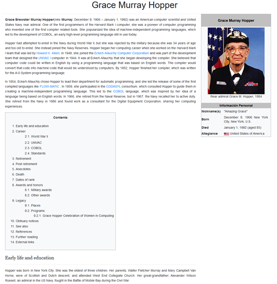

# Grace Munrray Hopper

La siguiente página tiene como objetivo mostrar la información de Grace Munrray Hopper haciendo uso de React.

## Estructura de carpetas

Debería verse de la siguiente manera:

```
grace-h-react/
  README.md
  node_modules/
  package.json
  public/
    index.html
    favicon.ico
  src/
    components/
      css/
        aside.css
        header.css
        main.css
      images/
        ee-uu.png
        grace-hopper.jpg
      Aside.js
      Header.js
      Main.js
    App.css
    App.js
    App.test.js
    index.css
    index.js
    logo.svg
```

## Componentes

La página se ha desarrollado con 4 componentes:

- App.js: componente que contiene a 3 componentes en él como son Header.js, Main.js, Aside.js 

- Header.js: componente Header, este componente es la cabecera de la p&aacute;gina, se encuentran insertadas las etiquetas `<header></header>` y dentro de ella la etiqueta `<h1></h1>` conteniendo el título. 

- Main.js: componente Main, este componente es el cuerpo de la p&aacute;gina, se encuentra la etiqueta `<main></main>` la cual contiene la biograf&iacute;a de Grace Munrray Hopper.

- Aside.js: componente Aside, en este componente se encuentra la etiqueta `<aside></aside>` la cual contiene informaci&oacute;n personal de Grace Munrray Hopper.

## Importando componentes

### `App.js`

```js
import React, { Component } from 'react';
import Header from './components/Header';
import Main from './components/Main';
import Aside from './components/Aside';

import './App.css';

class App extends Component {
  render() {
    return (
      <div className="App">
        <Header/>
        <Main/>
        <Aside/>
      </div>
    );
  }
}

export default App;
```

## Agregando estilos

La página tiene estilos para sus 4 componentes:

- App.css
- aside.css
- header.css
- main.css

### `Header.css`

```css
header h1{
	margin-bottom: .4em;
}

header hr{
	margin-top: 0;
	margin-bottom: 0;
}
```

### `Header.js`

```js
import React, { Component } from 'react';
import './css/header.css';

class Header extends Component {
  render() {
    return (
      //Código
    );
  }
}
```

## Agregando imágenes

```js
import React, {Component} from 'react';
import GraceHopper from './images/grace-hopper.jpg';
import eeuu from './images/ee-uu.png';

class Aside extends Component {
  render() {
    return (
       // Import result is the URL of your image
        ;
}

export default Aside;
```

### [GitHub Pages](https://pages.github.com/)

#### Step 1: Agrega `homepage` a `package.json`

Abra su `package.json` y agregue un campo ` homepage` para su proyecto::

```json
  "homepage": "https://LeslyN.github.io/grace-h-react",
```
La aplicación Create React usa el campo `homepage` para determinar la URL raíz en el archivo HTML creado.

# Anexos

